# Case_Study#8: FreshSegments

<p align="center">
        
</p>

---

# Introduction
Fresh Segments is a digitial marketing agency that helps other businesses to analyze trends in online ad click behavior. The dataset used in this case study consists of aggregated metrics for each interest for each month. This dataset consists of data from only a single client of Fresh Segments.

# Table of Contents

- [Problem Statement](#Problem-Statement)
- [Exploration](#Exploration)
- [Analysis](#Analysis)
- [Recommendations](#Recommendations)

# Problem Statement <a name = "Problem-Statement"></a>

We have been by the Fresh Segments, a digital marketing agency to analyze aggregated interest metrics of a clients' customers' ad click behaviour. 

We are expected to provide insights about segmentation. Details on interests that should be shown and to be avoided to the customers are also requested. 

Finally, we have been asked to look at overall performance through average composition index and make any recommendations necessary to improve the business for Fresh Segments. 


# Exploration
The dataset consists of two tables: Interest Metrics and Interest Map. The ERD for the dataset is below: 

```html
<iframe width="560" height="315" src='https://dbdiagram.io/embed/6226656061d06e6eadbb3b69'> </iframe>
```

**Metric Description:**

**Composition:** The composition value is the percentage of client's customers that interacted with specific interest.

**Index_value:** The index value describes composition value for an interest compared to all Fresh Segments clients' customer. So this means an index of 2 for a specific interest means that the composition value of the interest is 2 times the average composition value for all Fresh Segments clients' customer. 

## Dealing with NULLs
NULL entries in the `interest_metrics` table were found. It was observed that the NULL rows contained data for composition and index_value but no information was present for `_month`, `_year` and `month_year` columns. Since this information cannot be inferred, I decided to delete NULL rows from the table and use the resulting table for further analysis.

In my current approach, I deleted NULL rows direclty from the dataset. However, a better appoach would be to copy the data to a temp table and perform analysis on that table so that your raw data is preserved. 

```sql
SELECT 
  COUNT(month_year) AS record_counts
FROM fresh_segments.interest_metrics
WHERE month_year IS NULL;
--Dealing with Nulls : here it is best to delete those rows
DELETE FROM fresh_segments.interest_metrics WHERE month_year IS NULL;
```
Similarly, the `interest_map` table was also checked for NULLs and none were found. 

## Checking for Missing Data
Next I wanted to see if there is any missing/unexplained data in the dataset. For this I did the following:
1. Check if all the `interest_id` in the `interest_metrics` table are present in the `interest_map` table. 
    
    This is to make sure that we don't have any records that have `interest_id`s that are not present in the `interest_map` table. (No foreign keys that do not match with primary keys are present) 

    No records in the `interest_metrics` table were found with a foreign key(interest_id) that doesn't exist in `interest_map` table.
    
    ```sql
    SELECT 
        COUNT(DISTINCT(t1.interest_id)) AS total_interest_metrics_id,
        COUNT(DISTINCT(t2.id)) AS total_interest_map_id,
        COUNT(CASE WHEN t2.id IS NULL THEN t1.interest_id ELSE NULL END) AS in_metrics_notin_map,
        COUNT(CASE WHEN t1.interest_id IS NULL THEN t2.id ELSE NULL END) as notin_metrics_in_map
    FROM fresh_segments.interest_metrics AS t1 
    FULL OUTER JOIN fresh_segments.interest_map AS t2 
        ON t1.interest_id = t2.id;
    ```
    <details>
        <summary>Output</summary>
    | total_interest_metrics_id | total_interest_map_id | only_in_metrics | only_in_map|
    | ------------------------- | --------------------- | --------------- | -----------|
    |            1202           |           1209        |         0       |      7     |
    </details>
    

2. Check if there are any records of interests where the corresponding `month_year` is before the `created_at` date.
    ```sql
    WITH cte_join AS (
    SELECT
        interest_metrics.*,
        interest_map.interest_name,
        interest_map.interest_summary,
        interest_map.created_at,
        interest_map.last_modified
    FROM fresh_segments.interest_metrics
    INNER JOIN fresh_segments.interest_map
        ON interest_metrics.interest_id = interest_map.id
    WHERE interest_metrics.month_year IS NOT NULL
    )
    SELECT
        COUNT(*)
    FROM cte_join
    WHERE month_year < created_at;
    ```
    <details>
        <summary>Output</summary>
    | count |
    |-------|
    |   188 |
    </details>

    There are 188 records where `month_date` of a record is before the `created_at` date.
     <details>
        <summary>Why this makes sense in this case?</summary>
     In this particular case, this data makes sense as new interests could be created by breaking down and modifying older and broader categories to put more focus on certain interest categories. This is also useful when you want to take a deep dive at the data and understand which specific ads(interests) are performing well in terms of capturing customer attention. 

    For example, let's say we have two interst categories: Sports and automobile enthusiasts. The metrics for these don't really give us a lot of information and insight into performance of difference ads. If we want to know if bike ads have performing better than car ads, it is not possible with the current data. But if we break them down into narrow categories such as bike enthusiasts, car enthusiasts, NFL fans, NBA fans, the data is much more specific and gives us a lot more insights into how well the specific ad campaigns are working. 

    Another reason for this anomaly to make sense is that we are using first day of the month as a proxy for our aggregared monthly metrics. The new interest might be created sometime in the middle of a month. 
    </details>
3. Check the uniqueness of primary keys in `interest_map` table. 
    To check if there are multiple entries with the same interest_id. 
    ```sql
    WITH record_counts AS(
    SELECT 
        id,
        COUNT(id) AS records
    FROM fresh_segments.interest_map
    GROUP BY id
    )
    SELECT 
        records,
        COUNT(id) AS interest_ids
    FROM record_counts
    GROUP BY records;
    ```
    <details>
        <summary>Output</summary>
    | records | interest_id_count |
    |---------|-------------------|
    |     1   |       1209        |
    </details>

    All interest ids were found to be unique. 


# Analysis
The analysis of the dataset is divided into 3 segments. 
1. [Interest Analysis](##Interest-Analysis)
2. [Segment Analysis](##Segment-Analysis)
3. [Index Analysis](##Index-Analysis)

## Interest Analysis <a name = "Interest-Analysis"></a>
In this section, I looked at how many interests were present for each month and how many interests were present in total_months. This tells us which interests are most frequent (number of months an interest shows up ) and which ones are not performing well (not frequent, only shows up in few months). It would also explain how newly introduced interests are performing(interests that show up in fewer months). 
1. Number of intersts present in each month
    ```sql
    SELECT
        month_year,
        COUNT(*) AS interest_count
    FROM fresh_segments.interest_metrics
    GROUP BY month_year
    ORDER BY month_year;
    ```
    <details>
        <summary>Output</summary>
    <p align="center">
        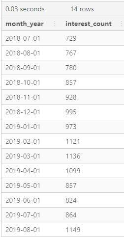
    </p>
    </details>

2. Total number of months an interst id is present in
    ```sql
    WITH month_yearPer_interest AS(
    SELECT 
        interest_id,
        COUNT(DISTINCT (month_year)) AS month_year_counts
    FROM fresh_segments.interest_metrics
    GROUP BY interest_id
    )
    SELECT 
        month_year_counts,
        COUNT(interest_id) AS interest_count
    FROM month_yearPer_interest
    GROUP BY month_year_counts
    ORDER BY month_year_counts DESC;
    ```
    <details>
        <summary>Output</summary>
    <p align="center">
        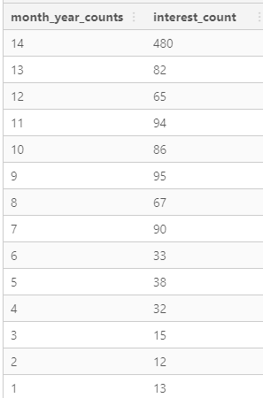
    </p>
    </details>

3. Cumulative percentage of all records
    ```sql
    WITH month_yearPer_interest AS(
    SELECT 
        interest_id,
        COUNT(month_year) AS month_year_counts
    FROM fresh_segments.interest_metrics
    GROUP BY interest_id
    )
    SELECT 
        month_year_counts,
        COUNT(interest_id) AS interest_count,
        ROUND(100*SUM(COUNT(interest_id)) OVER(ORDER BY month_year_counts DESC)/ SUM(COUNT(interest_id)) OVER(),    2) AS cumulative_percent
    FROM month_yearPer_interest
    GROUP BY month_year_counts
    ORDER BY month_year_counts DESC;
    ```
    <details>
        <summary>Output</summary>
    <p align="center">
        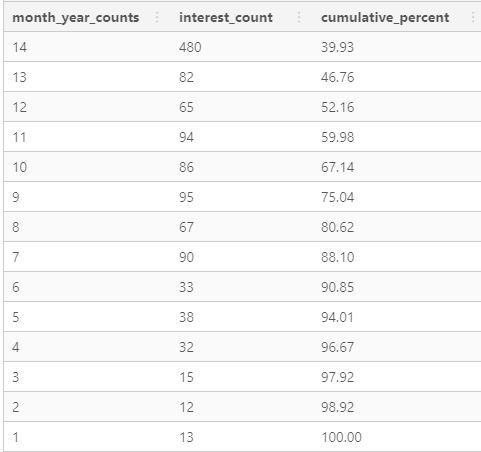
    </p>
    </details>
    
    3.1. Number of records whose `month_year_counts` < threshold 
    
    ```sql
    WITH unremoved_records AS(
    SELECT 
        interest_id
    FROM fresh_segments.interest_metrics
    WHERE interest_id IS NOT NULL
    GROUP BY interest_id
    HAVING COUNT(DISTINCT month_year) >=6
    )
    SELECT
        COUNT(*) AS removed_records
    FROM fresh_segments.interest_metrics
    WHERE NOT EXISTS (
            SELECT 1
            FROM unremoved_records
            WHERE interest_metrics.interest_id = unremoved_records.interest_id);

    ```
    <details>
        <summary>Output</summary>
    | records_removed |
    |-----------------|
    |     400         |
    </details>

## Segment Analysis <a name = "Segment-Analysis"></a>
1. Top 10 and bottom 10 maximum composition values.

    Among the maximum composition values for each month identify the top 10 and bottom 10 interests and their respective `month_year`
    ```sql
    WITH max_compositions AS(
    SELECT
        interest_id,
        interest_metrics.month_year,
        interest_map.interest_name,
        interest_metrics.composition,
        MAX(composition) OVER(PARTITION BY interest_id) AS max_composition
    FROM fresh_segments.interest_metrics
    INNER JOIN fresh_segments.interest_map
        ON interest_metrics.interest_id = interest_map.id
    ),
    final_compositions AS(
    SELECT 
        max_compositions.month_year,
        max_compositions.interest_name,
        max_compositions.max_composition
    FROM max_compositions
    WHERE max_composition = composition
    )
    --Enclose select statements in brackets when using order by for union. 
    (SELECT * FROM final_compositions ORDER BY max_composition DESC LIMIT 10)
    UNION 
    (SELECT * FROM final_compositions ORDER BY max_composition LIMIT 10)
    ORDER BY max_composition DESC;
    ```
    <details>
        <summary>Output</summary>
    <p align="center">
        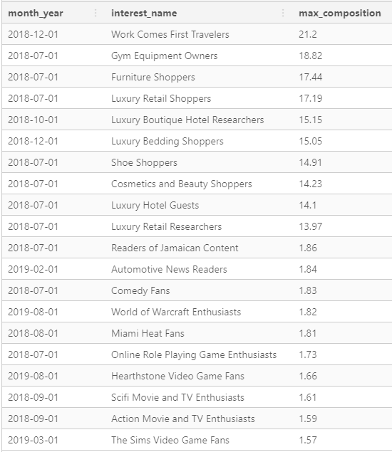
    </p>
    </details>

2. Interests with lowest average ranking value
    ```sql
    SELECT
        interest_map.interest_name,
        ROUND(AVG(ranking),1) AS average_ranking,
        COUNT(*) AS record_count
    FROM fresh_segments.interest_metrics
    INNER JOIN fresh_segments.interest_map
        ON interest_metrics.interest_id = interest_map.id
    GROUP BY interest_map.interest_name
    ORDER BY average_ranking
    LIMIT 5;
    ```
    <details>
        <summary>Output</summary>
    <p align="center">
        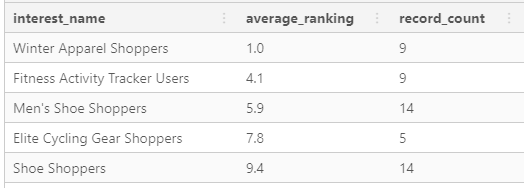
    </p>
    </details>

    2.1. Interests with highest average ranking value
    ```sql
    SELECT
        interest_map.interest_name,
        ROUND(AVG(ranking),1) AS average_ranking,
        COUNT(*) AS record_count
    FROM fresh_segments.interest_metrics
    INNER JOIN fresh_segments.interest_map
        ON interest_metrics.interest_id = interest_map.id
    GROUP BY interest_map.interest_name
    ORDER BY average_ranking
    LIMIT 5;
    ```

    <details>
        <summary>Output</summary>
    <p align="center">
        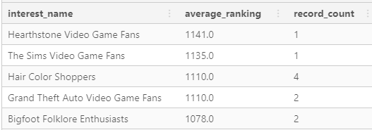
    </p>
    </details>

3. Interests with largest standard deviation in `percentile_ranking` value
    ```sql
    SELECT
        interest_metrics.interest_id,
        interest_map.interest_name,
        ROUND(CAST(STDDEV(percentile_ranking)AS NUMERIC),1) AS stddev_pc,
        MAX(percentile_ranking) AS max_pc,
        MIN(percentile_ranking) AS min_pc,
        COUNT(*) AS record_counts
    FROM fresh_segments.interest_metrics
    INNER JOIN fresh_segments.interest_map
        ON interest_metrics.interest_id = interest_map.id
    WHERE month_year IS NOT NULL
    GROUP BY 
        interest_metrics.interest_id,
        interest_map.interest_name
    HAVING STDDEV(percentile_ranking) IS NOT NULL
    ORDER BY stddev_pc DESC
    LIMIT 5;
    ```
    <details>
        <summary>Output</summary>
    <p align="center">
        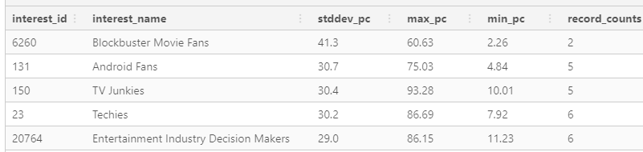
    </p>
    </details>

4. For the 5 interests above what are the max, min and composition values in their corresponding `month_year` value?  
    ```sql
    WITH max_stddev_interests AS(
    SELECT
        interest_metrics.interest_id,
        interest_map.interest_name,
        ROUND(CAST(STDDEV(percentile_ranking)AS NUMERIC),1) AS stddev_pc,
        MAX(percentile_ranking) AS max_pc
    FROM fresh_segments.interest_metrics
    INNER JOIN fresh_segments.interest_map
        ON interest_metrics.interest_id = interest_map.id
    WHERE month_year IS NOT NULL
    GROUP BY 
        interest_metrics.interest_id,
        interest_map.interest_name
    HAVING STDDEV(percentile_ranking) IS NOT NULL
    ORDER BY stddev_pc DESC
    LIMIT 5
    )
    SELECT 
        t2.interest_name,
        t1.month_year,
        t1.ranking,
        t1.percentile_ranking,
        t1.composition,
        t2.stddev_pc,
    --RANKING to order the output in the same sequence as we obtained in previous question. 
    --Ordered in descending order for highest std_dev(percentile_ranking)
        RANK()OVER(ORDER BY stddev_pc DESC) AS max_stddev_ranking
    FROM fresh_segments.interest_metrics AS t1 
    INNER JOIN max_stddev_interests AS t2 
        ON t1.interest_id = t2.interest_id
    ORDER BY 7, 4 DESC ;
    ```
    <details>
        <summary>Output</summary>
    <p align="center">
        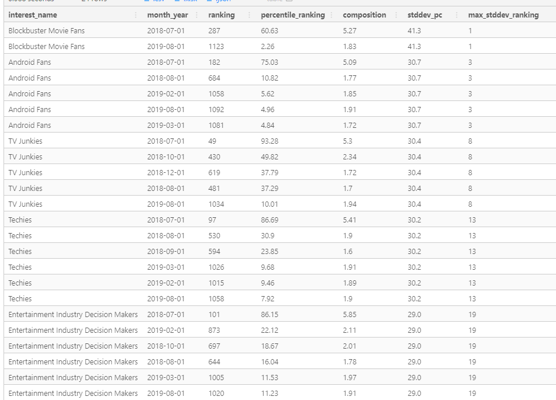
    </p>
    </details>

## Index Analysis <a name = "Index-Analysis"></a>
1. Top 10 interests by average composition for each month? 
    ```sql
    WITH avg_compositions AS(
    SELECT 
        interest_metrics.month_year,
        interest_map.interest_name,
        ROUND(CAST (interest_metrics.composition / interest_metrics.index_value AS NUMERIC) , 2) AS index_composition,
        RANK()OVER(PARTITION BY month_year ORDER BY interest_metrics.composition / interest_metrics.index_value DESC) AS index_rank
    FROM fresh_segments.interest_metrics
    INNER JOIN fresh_segments.interest_map
        ON interest_metrics.interest_id = interest_map.id
    )
    SELECT *
    FROM avg_compositions
    WHERE index_rank <=10;
    ```
    <details>
        <summary>Output</summary>
    <p align="center">
        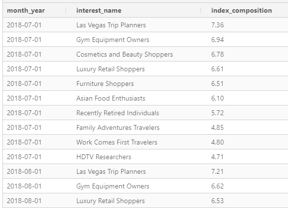
    </p>
    </details>

2. For all of these top 10 interests - which interest appears the most often?
    ```sql
    WITH avg_compositions AS(
    SELECT 
        interest_metrics.month_year,
        interest_map.interest_name,
        ROUND(CAST (interest_metrics.composition / interest_metrics.index_value AS NUMERIC) , 2) AS index_composition,
        RANK()OVER(PARTITION BY month_year ORDER BY interest_metrics.composition / interest_metrics.index_value DESC) AS index_rank
    FROM fresh_segments.interest_metrics
    INNER JOIN fresh_segments.interest_map
        ON interest_metrics.interest_id = interest_map.id
    )
    SELECT 
        interest_name,
        COUNT(*) AS interest_frequency
    FROM avg_compositions
    WHERE index_rank <=10
    GROUP BY interest_name
    ORDER BY interest_frequency DESC;
    ```
    <details>
        <summary>Output</summary>
    <p align="center">
        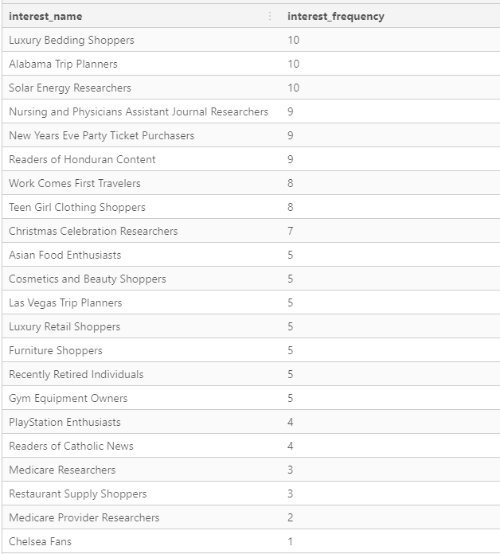
    </p>
    </details>

3. What is the average of the average composition for the top 10 interests for each month?
    ```sql
    WITH avg_compositions AS(
    SELECT 
        interest_metrics.month_year,
        interest_map.interest_name,
        ROUND(CAST (interest_metrics.composition / interest_metrics.index_value AS NUMERIC) , 2) AS index_composition,
        RANK()OVER(PARTITION BY month_year ORDER BY interest_metrics.composition / interest_metrics.index_value DESC) AS index_rank
    FROM fresh_segments.interest_metrics
    INNER JOIN fresh_segments.interest_map
        ON interest_metrics.interest_id = interest_map.id
    )
    SELECT 
        month_year,
        ROUND(AVG(index_composition),2)AS avg_index_composition
    FROM avg_compositions
    WHERE index_rank <=10
    GROUP BY month_year
    ORDER BY 1;
    ```
    <details>
        <summary>Output</summary>
    <p align="center">
        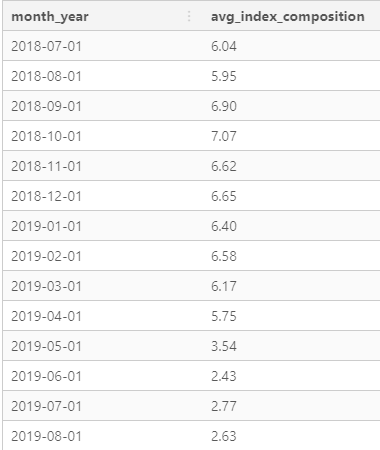
    </p>
    </details>

4. What is the 3 month rolling average of the max average composition value from September 2018 to August 2019?
    ```sql
    WITH compositions AS(
    SELECT 
        interest_metrics.month_year,
        interest_map.interest_name,
        ROUND(CAST (interest_metrics.composition / interest_metrics.index_value AS NUMERIC), 2) AS index_composition,
        MAX(ROUND(CAST (interest_metrics.composition / interest_metrics.index_value AS NUMERIC) , 2))
            OVER(PARTITION BY month_year) AS max_index_composition,
        RANK()OVER(PARTITION BY month_year 
            ORDER BY interest_metrics.composition / interest_metrics.index_value DESC) AS index_rank
    FROM fresh_segments.interest_metrics
    INNER JOIN fresh_segments.interest_map
        ON interest_metrics.interest_id = interest_map.id
    ),
    max_composition_data AS(
    SELECT
        month_year,
        interest_name,
        max_index_composition,
        ROUND(AVG(max_index_composition)OVER(
            ORDER BY month_year
            RANGE BETWEEN '2 MONTHS' PRECEDING AND '0 MONTH' PRECEDING ),2) AS mvg_avg_3month,
        LAG(interest_name || ': ' || max_index_composition, 1)OVER(ORDER BY month_year) AS "1month_ago",
        LAG(interest_name || ': ' || max_index_composition, 2)OVER(ORDER BY month_year) AS "2months_ago"
    FROM compositions
    WHERE index_rank = 1
    )
    SELECT *
    FROM max_composition_data
    WHERE "2months_ago" IS NOT NULL
    ```
    <details>
        <summary>Output</summary>
    <p align="center">
        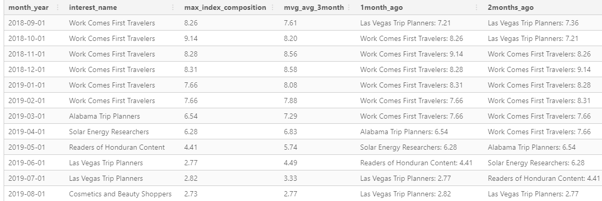
    </p>
    </details>

# Recommendations

* After looking at the composition values of interets and analyzing the standard deviation and average rankings of interests, the following recommendations are made: 
1. Our customers in this segment purchase high-end luxury products and shoes. More ads on luxury products, hotels and vacations including shoes should be shown. 
2. Ads that fall into interest segments on video games and movies(SciFi and action genres) should be avoided. 
3. Some segments such as blockbuster movie fans, android fans, TV junkies, Techies and Entertainment Industry Decision makers seem to be periodic or seasonal. So market segmentation should be made more dynamic to effectively capture customer behaviour and increase profits. 

* Decreasing composition index over the months suggests that the fewer customers of our clients are watching/clicking on the targeted ads. This suggests that Fresh Segments might be using an ineffective strategy to target their customers. 

* Focusing marketing strategy based off the interests of specific clients' customers would result in targeting niche segments for each client. This ignores the broader picture of varying trends in index populations thereby making our ads ineffective overtime. 


